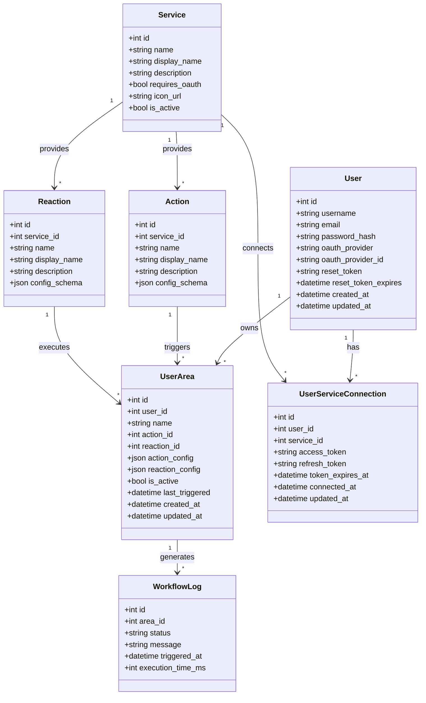
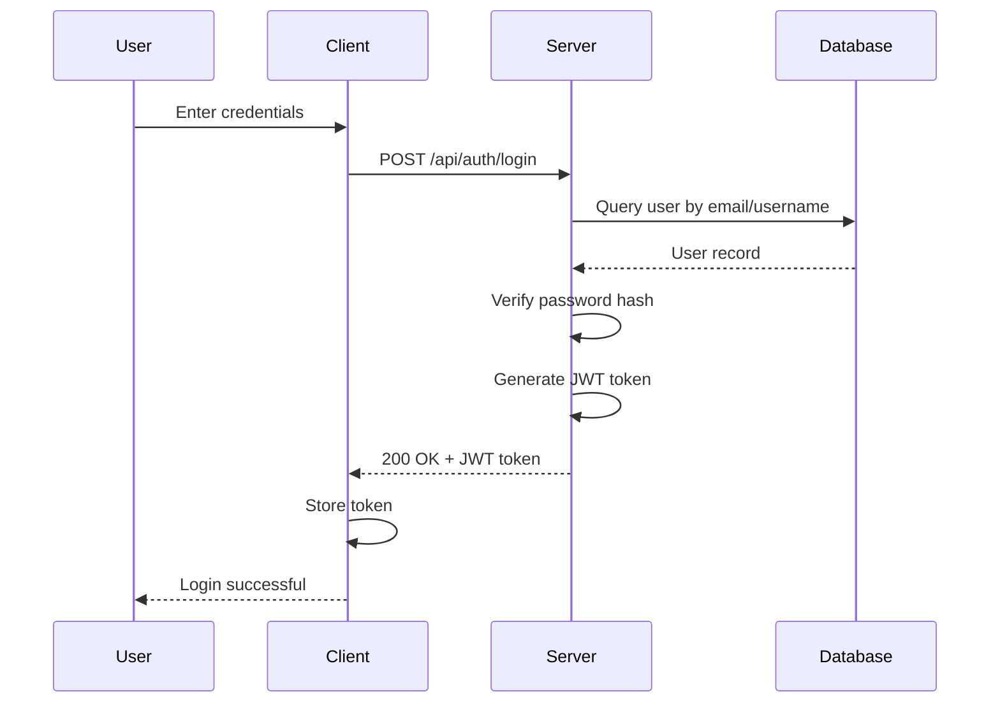
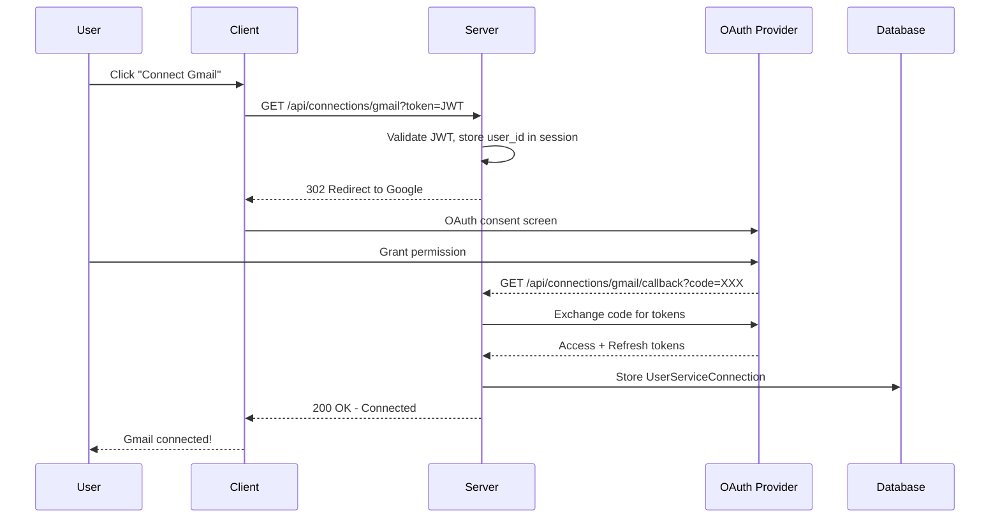
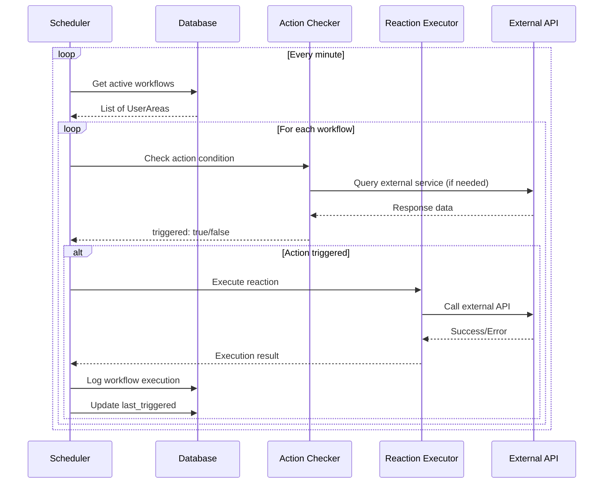
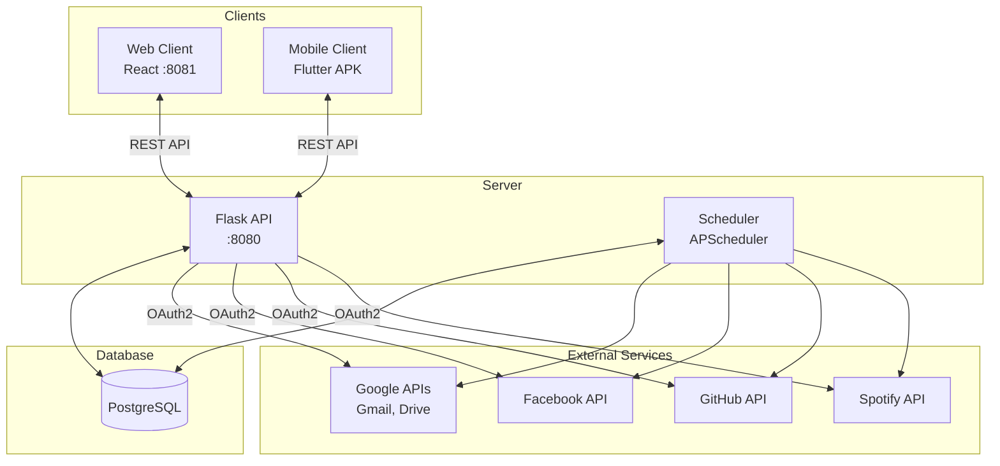
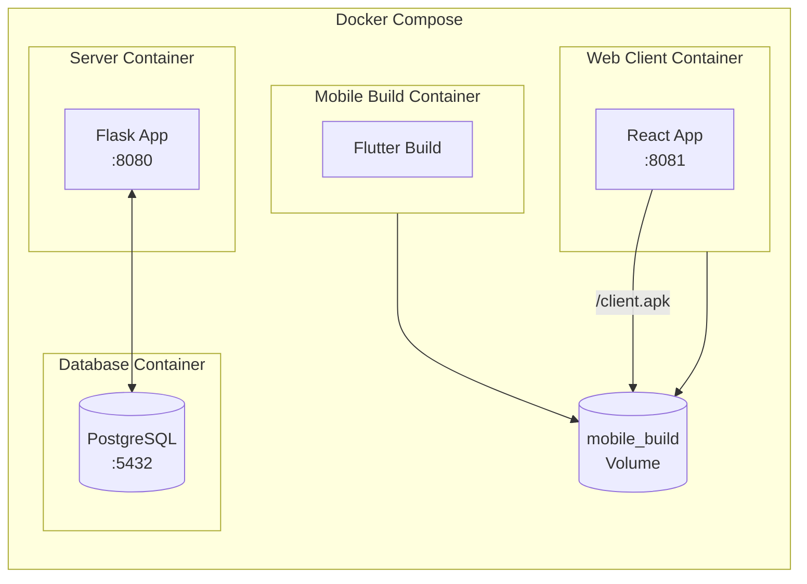

# Architecture & Diagrams

This document provides visual representations of the AREA platform architecture.

---

## Class Diagram - Database Models

---

## Sequence Diagram - User Authentication

---

## Sequence Diagram - OAuth2 Service Connection

---

## Sequence Diagram - Workflow Execution

---

## Component Diagram - System Architecture

---

## Docker Architecture

